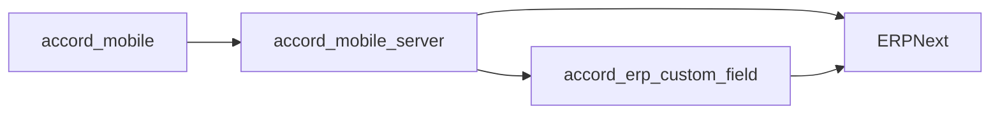

# Accord Mobile Server

Accord Mobile Server is the Go backend that mediates between `accord_mobile` and ERPNext. It is the authoritative business layer for mobile workflow behavior, but it is not an island: it depends on ERPNext for document persistence and on `accord_erp_custom_field` for the workflow fields that keep `Delivery Note` semantics stable.

## System Topology



The practical execution chain is:

`accord_mobile -> accord_mobile_server -> ERPNext`

## Repository Role

This repository owns:

- authentication for Supplier, Werka, Customer, and Admin roles
- translation of mobile actions into ERPNext operations
- mobile-facing summary, history, and detail APIs
- push token registration and notification dispatch
- state synchronization for delivery flows
- fallback logic that keeps workflow fields available when ERP field drift occurs

This repository does not own the user interface. It does not replace ERPNext. It does not define the long-term schema by itself.

## Direct Dependencies

`accord_mobile_server` requires:

- ERPNext
- the `accord_erp_custom_field` app installed in the ERPNext bench
- access credentials for the ERPNext site
- the mobile client to supply valid tokens and request payloads
- optional Firebase credentials for push notification delivery

## Why The Custom Field App Matters

The server relies on structured `Delivery Note` metadata.

The following ERP fields are part of the contract:

- `accord_flow_state`
- `accord_customer_state`
- `accord_customer_reason`
- `accord_delivery_actor`
- `accord_status_section`
- `accord_ui_status`

The preferred source of truth for creating and maintaining those fields is the ERP custom field app, not the server fallback layer. The fallback exists to keep production flows alive when field setup drifts.

## Main Responsibilities

### Supplier flow

- receive mobile dispatch requests
- create `Purchase Receipt` records in ERPNext
- expose history, summary, and item APIs

### Werka flow

- receive customer issue submissions
- create and submit `Delivery Note`
- support batch customer issue creation
- provide read-heavy endpoints for picker, summary, and archive views

### Customer flow

- validate and update delivery response state
- keep confirm as a state update only
- create a real return `Delivery Note` on reject

### Admin flow

- expose management APIs for suppliers, customers, and items
- support operational lookup and reconciliation

## Delivery Note Semantics

Customer delivery state is tracked on the ERPNext `Delivery Note`.

Behavioral rule:

- `confirm` updates the original document and must not create a return
- `reject` creates a real return document with `is_return = 1` and `return_against = <original DN>`

That rule is enforced in the backend because the client must remain thin and the ERP state must remain authoritative.

## API Surface

Main entry points:

- `cmd/core/main.go`
- `internal/mobileapi/server.go`
- `internal/core/service.go`
- `internal/erpnext/client.go`
- `internal/erpnext/delivery_note.go`
- `internal/erpnext/purchase_receipt.go`

Primary route families:

- `/healthz`
- `/v1/mobile/auth/*`
- `/v1/mobile/supplier/*`
- `/v1/mobile/werka/*`
- `/v1/mobile/customer/*`
- `/v1/mobile/admin/*`
- `/v1/mobile/push/*`

## Runtime Files

The server stores local runtime state in JSON files when running as a local instance:

- `data/mobile_profile_prefs.json`
- `data/mobile_admin_suppliers.json`
- `data/mobile_push_tokens.json`
- `data/mobile_sessions.json`

These files are useful for local and single-instance operation. They are not a substitute for ERPNext persistence.

## Run Modes

### Local API only

```bash
make run-api
```

### Local API with direct ERP DB reads

```bash
make run-local-db
```

### Local API plus public tunnel/domain bootstrap

```bash
make run
```

### Tests

```bash
make test
```

## Operational Checks

Useful checks:

- `curl http://127.0.0.1:8081/healthz`
- inspect `./.core.log`
- confirm that mobile requests hit `/v1/mobile/werka/customer-issue/create`
- confirm ERPNext actually received the `Delivery Note`
- confirm a return document is created only on reject

## Related Repositories

- Mobile client: [accord_mobile](https://github.com/WIKKIwk/accord_mobile)
- ERP custom field app: [accord_erp_custom_field](https://github.com/WIKKIwk/accord_erp_custom_field)

## Deployment Notes

- The backend can run independently from the Telegram bot, but it is still coupled to ERPNext.
- Release builds and public endpoints should point to a stable domain, not to localhost.
- If ERP workflow semantics change, update this README together with the mobile client and ERP field app README files.

